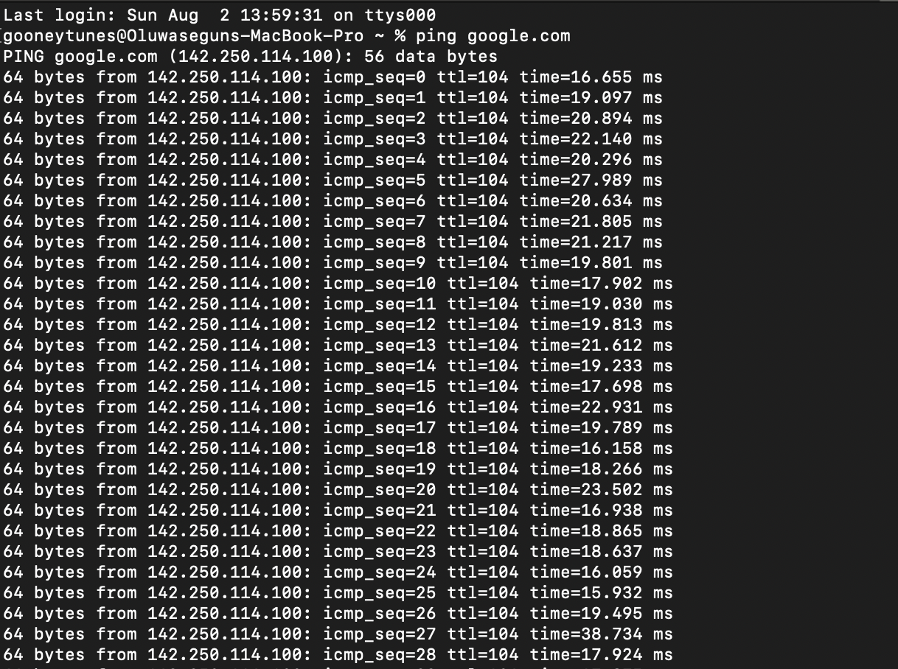
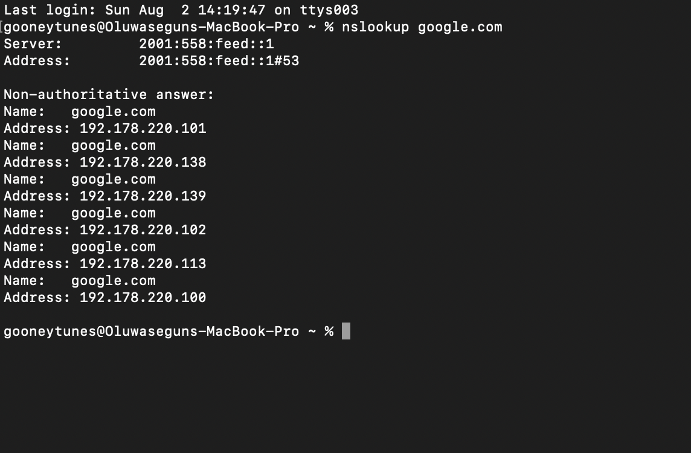
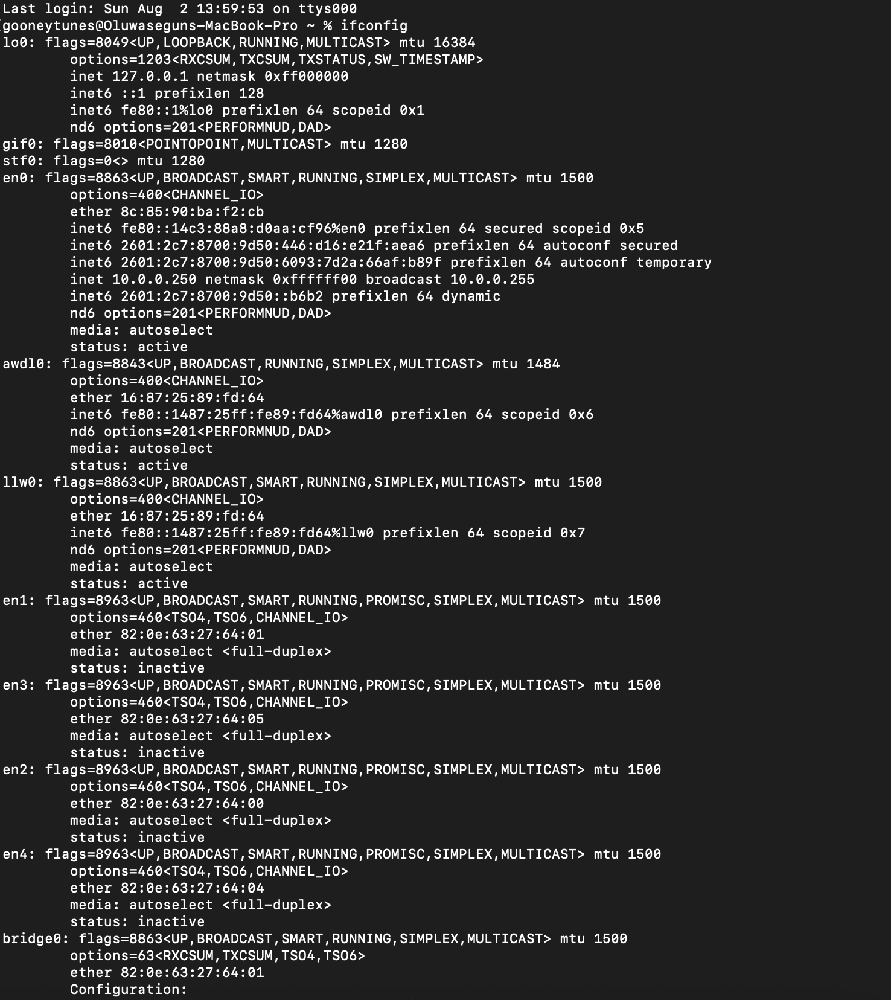
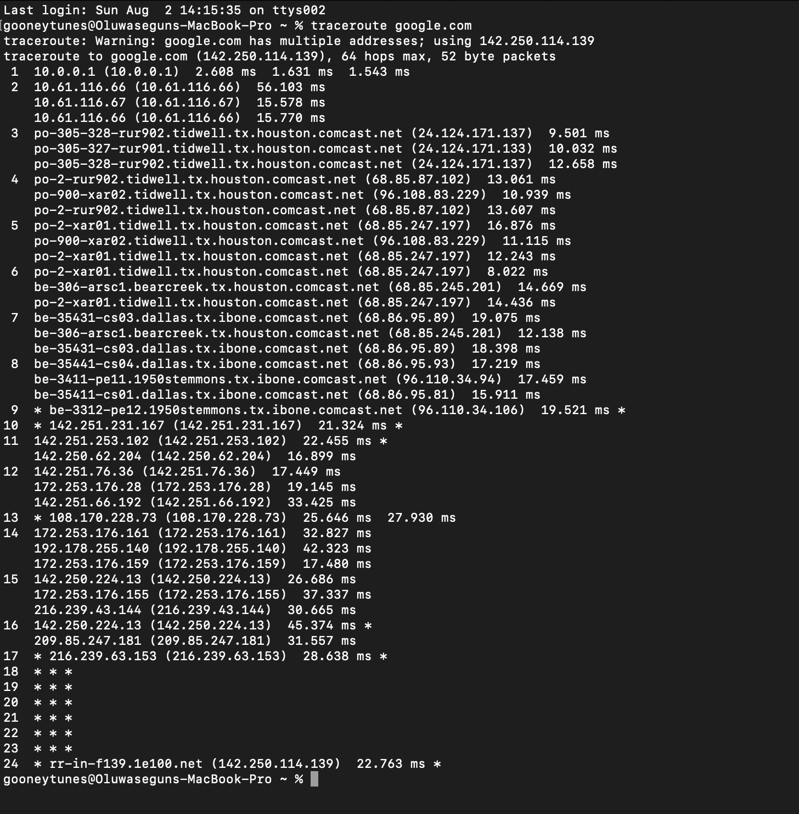

# Lab 1 – Network Basics

## Objective
Learn how to identify network settings and test connectivity.

## Tools
- Terminal
- ping
- ifconfid/ipconfig
- nslookup
- traceroute

## Commands Used

ping google.com

nslookup google.com

ifconfig google.com
ipconfig google.com

traceroute google.com

## Results
### MacOS

ping

Nslookup

Ifconfig

Traceroute

## What I Learned

Explain the concepts in your own words.

## Real-World Use

IT support technicians use these commands to diagnose internet, DNS, and connectivity problems.
